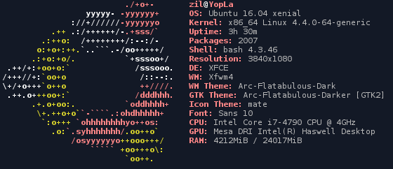

# dotfiles

[](https://raw.githubusercontent.com/duquerroy/dotfiles/master/screenshot.png)

### Package
Create a backup of what packages are currently installed:

```dpkg --get-selections > package.txt```

Then (on another system) restore installations from that list:

```
dpkg --clear-selections
sudo dpkg --set-selections < package.txt
```

To get rid of stale packages:

```sudo apt-get autoremove```

To get installed like at backup time (i.e. to install packages set by dpkg --set-selections):

```sudo apt-get dselect-upgrade```


